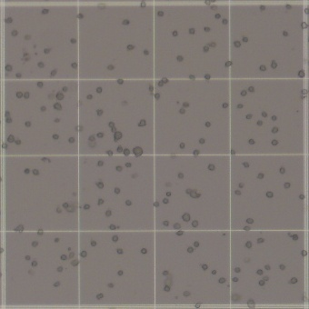

# HemoCrop
CV to recognize hemocytometer grid further count cells within grid-line (100x scale)

## Scope

 

Align(Rotation & Crop) the image, see below
 
 

## 알림
### 경북대학교 대학원정책실 주관
KNU 대학원생 융복합연구공동체(2022학년도 2학기) 최우수상 수상
