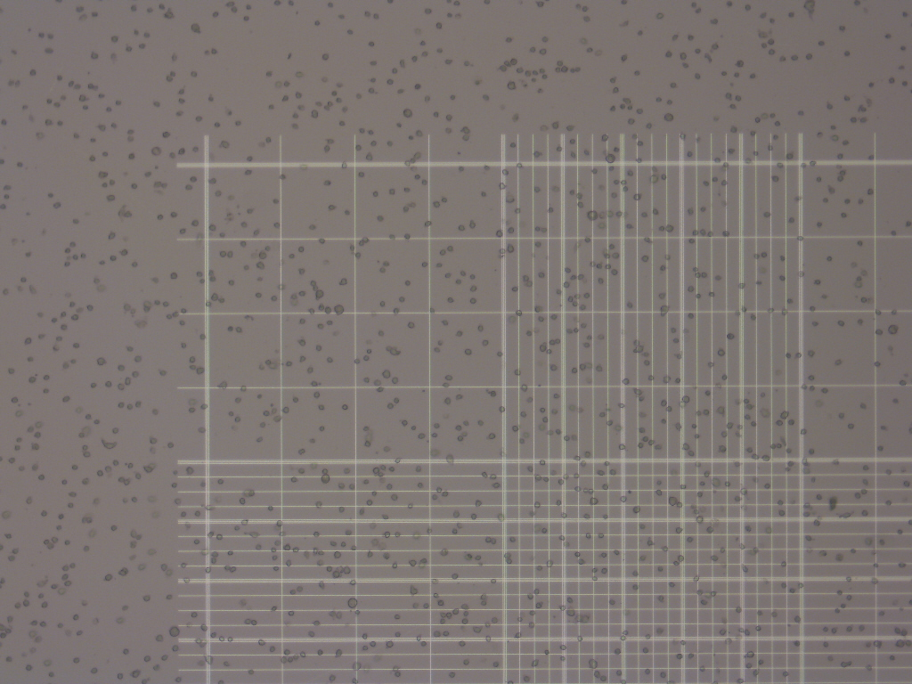

# HemoCrop
CV to recognize hemocytometer grid further count cells within grid-line (100x scale).

Very simple algorithm could crop grid of chamber.

All of hemocytometer pictures are use freely.

## Scope

 

Align(Rotation & Crop) the image, see below
 
 

## Milestones
### 경북대학교 대학원정책실 주관
- KNU 대학원생 융복합연구공동체(2022학년도 2학기) 최우수상 수상
- Rewarded 1,500,000 KRW
- [Youtube Video Link][Ext1]

## Result (Error rate)
### 2023.4.11 - 1.4% (2/143)
### 2025.8.29 - 19.9% (206 Processed, 26 truncated, 15 심각한 오류)

## Citation
Updates soon.

[Ext1]:https://www.youtube.com/live/WCEYZ2MnqMQ?si=DPl2egBpWaAHUCdS&t=3559
